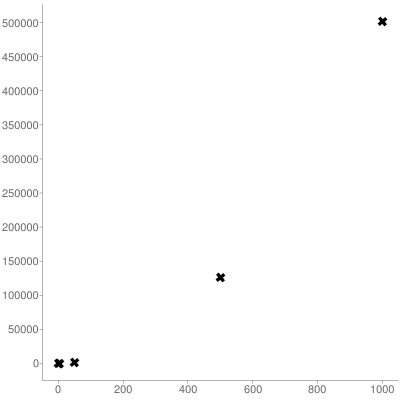

# Complexity Template

Use this site for plotting:

[http://www.alcula.com/calculators/statistics/scatter-plot/](http://www.alcula.com/calculators/statistics/scatter-plot/)

## Example

```cpp
#include <stdio.h>
#include <stdlib.h>

/**
 * @brief Function containing some algorithm.
 * 
 * @param N [in] size of "instance"
 * @return int number of executed instructions
 */
int algorithm(int N);

int main() {

    int workSizes[] = {1, 5, 50, 500, 1000};

    printf("f(n) series to insert at http://www.alcula.com/calculators/statistics/scatter-plot/: \n");
    for(int i = 0; i < sizeof(workSizes)/sizeof(int); i++) {
        int n = workSizes[i];

        int numberInstructions = algorithm(n);

        printf("%d, %d\n", n, numberInstructions);        
    }

    printf("\n");
    return EXIT_SUCCESS;
}

int algorithm(int N) {
    int instructions = 0;

    /* try other algorithms */

    for(int i=0; i<=N; i++) 
        for(int j=0; j<=N/2; j++)
            instructions++;

    /* --- */

    return instructions;
}
```

*outputs*:

```markdown
$ make && ./prog
gcc -o prog main.c
f(n) series to insert at http://www.alcula.com/calculators/statistics/scatter-plot/: 
1, 2
5, 18
50, 1326
500, 125751
1000, 501501
```

Copy/paste the lines with numbers at the site. For this result you get:



- *x-axis*: `N`
- *y-axis*: `Number of instructions`
